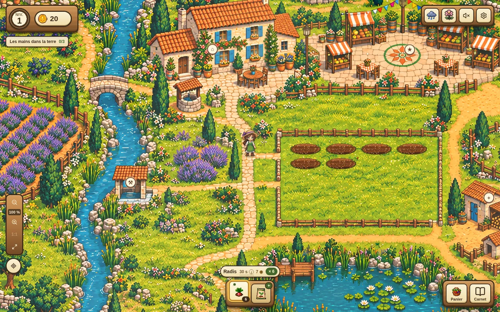

# 🌻 Farmicia

**Un jeu de ferme paisible, en pixel art, qui tient dans un onglet.**
Avec Rosalie, semez, arrosez, récoltez, cuisinez, et faites rayonner un petit village de Provence — dans l'esprit de *Stardew Valley*, mais en une poignée de minutes à la fois.



> *« Un petit jardin, de grandes découvertes. »*

---

## 🎮 Jouer

👉 **[Jouer dans le navigateur](https://j-trioux.github.io/Farmicia/)**

Rien à installer, rien à créer : la partie se sauvegarde toute seule dans le navigateur. Les cultures continuent de pousser pendant votre absence — revenez quand vous voulez, la ferme vous attend.

Ça se joue à la souris, au doigt, ou entièrement au clavier.

---

## 🌱 Ce qu'on y fait

| | |
| --- | --- |
| **Cultiver** | Douze cultures, du radis de trente secondes au melon qui mûrit la nuit. Arroser améliore la qualité, la maîtrise d'une culture ouvre ses secrets. |
| **Cuisiner** | L'atelier transforme les récoltes en pains, confitures, ratatouilles et tartes. La qualité des ingrédients se retrouve dans l'assiette. |
| **Servir le village** | Commandes du marché, paniers composés, repas prestigieux : chaque habitant a ses goûts et ses habitudes. |
| **Mener des projets** | Les grands projets du village avancent à votre rythme, sans minuterie, et transforment durablement la ferme. |
| **Choisir ses terres** | Trois terroirs, des lignées de graines que vous créez vous-même, des caractères à transmettre de récolte en récolte. |
| **Voyager** | La caravane part pour la vallée, charge vos produits et revient avec des pièces, de la réputation et des nouvelles des bourgs voisins. |
| **Fêter** | Foires de saison et concours gourmands, avec un jury qui a ses préférences. |

Et autour de tout ça : le soleil qui tourne, la pluie qui tombe, les poules qui picorent, les lucioles au-dessus de l'étang.

---

## 🎨 Direction artistique

Pixel art original, dessiné pour ce projet : palette limitée, contours nets, aucune image empruntée à un jeu commercial. La carte est peinte en une seule grande planche, déclinée en quatre saisons, et l'ambiance (lumière, météo, petites bêtes) est dessinée par-dessus sur un canevas, sans jamais coûter une image par seconde.

---

## 🛠️ Sous le capot

- **React 19** + **TypeScript**, rendu par **vinext** (Vite)
- Aucune base de données, aucun compte : la partie vit dans le `localStorage` du navigateur, avec export et import en JSON
- Un seul canevas pour toute l'ambiance, mis en pause quand l'onglet est caché
- Respect de la préférence système « animations réduites », navigation clavier et libellés ARIA partout
- Site entièrement statique : il se publie sur GitHub Pages à chaque poussée sur `main`

### Lancer le jeu en local

```bash
npm install
npm run dev      # http://localhost:3000
```

### Compiler le site statique

```bash
npm run build                                   # produit dist/client
node tools/pages-base.mjs dist/client  # site servi à la racine
```

Pour une page de projet GitHub (`https://<compte>.github.io/<dépôt>/`), passez le chemin de base :

```bash
node tools/pages-base.mjs dist/client /Farmicia
```

Node 22.13 ou plus récent est requis.

---

## 📁 Organisation

```
app/         pages, styles et fenêtres du jeu
components/  carte, carnet, panneaux, primitives d'interface
lib/         règles du jeu, sauvegarde, ambiance, données
hooks/       caméra, horloge partagée
public/      images pixel art, curseurs, icône
tools/       script de publication GitHub Pages
```

Ce dépôt ne contient que le jeu et ce qu'il faut pour le publier. Les sources de travail (planches HD, croquis, scripts de fabrication des images), les notes de build et les tests restent hors du dépôt.

---

## 📜 À propos

Projet personnel, écrit en français, développé pas à pas avec l'aide d'assistants IA. Le pixel art et les textes sont originaux.

Les retours sont les bienvenus : ouvrez une *issue* ou dites-le simplement à Rosalie. 🌾
